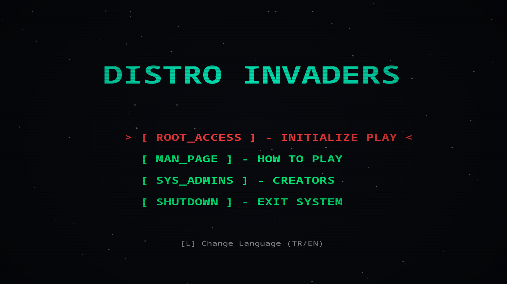
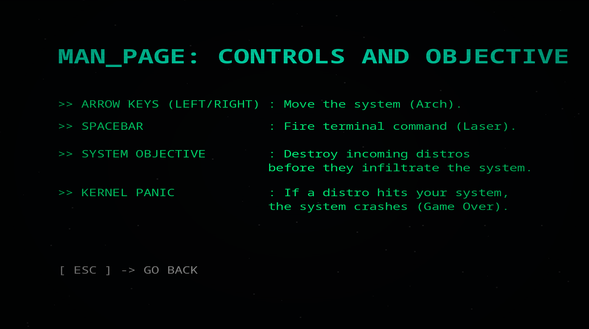
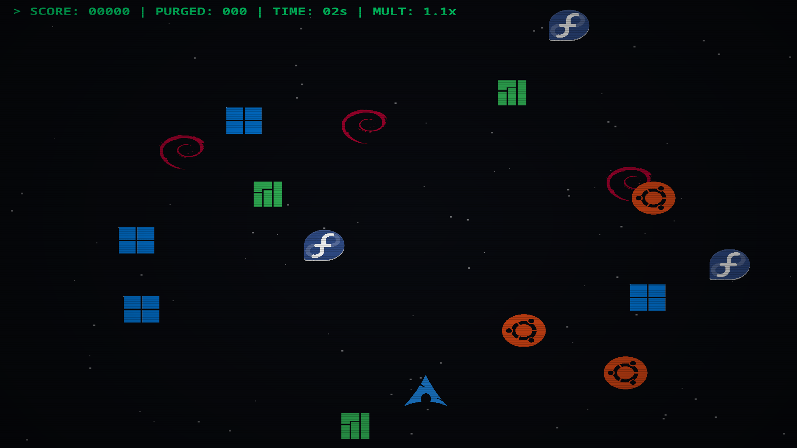
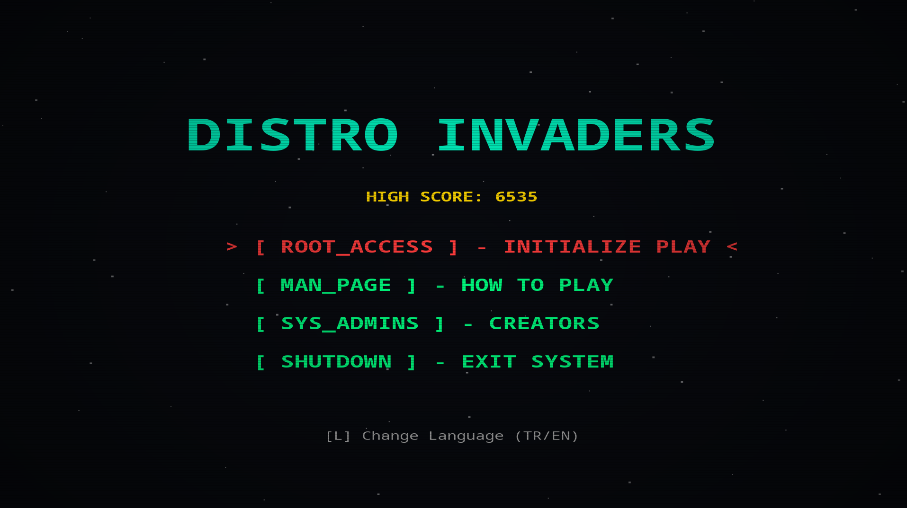
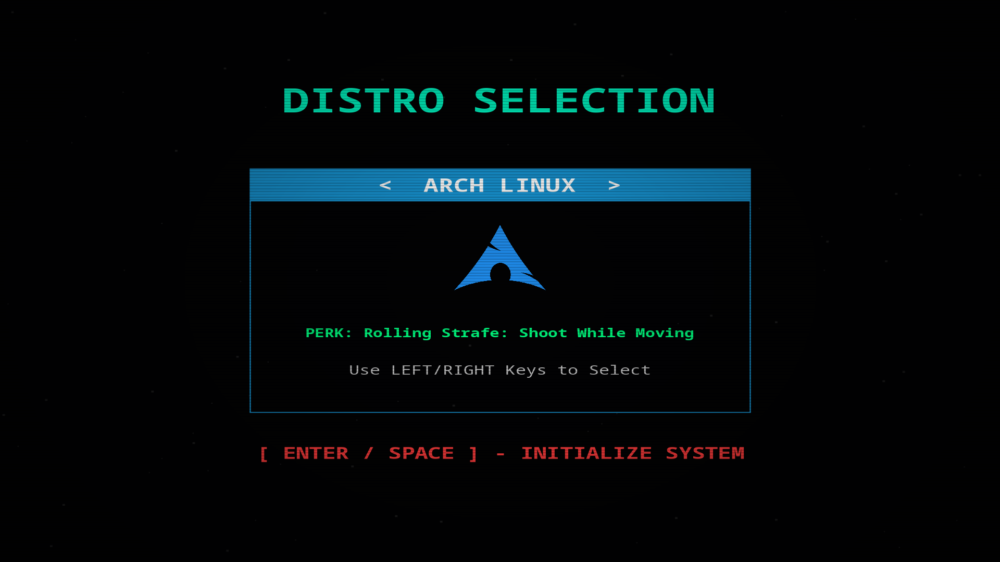
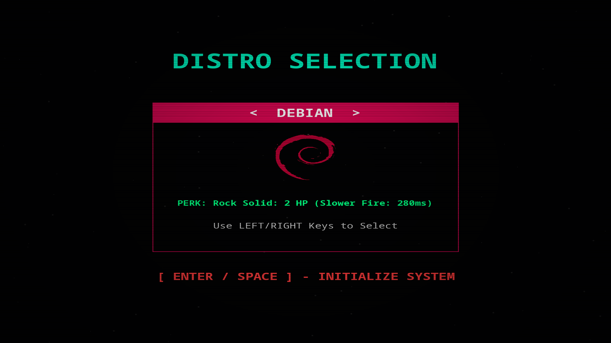
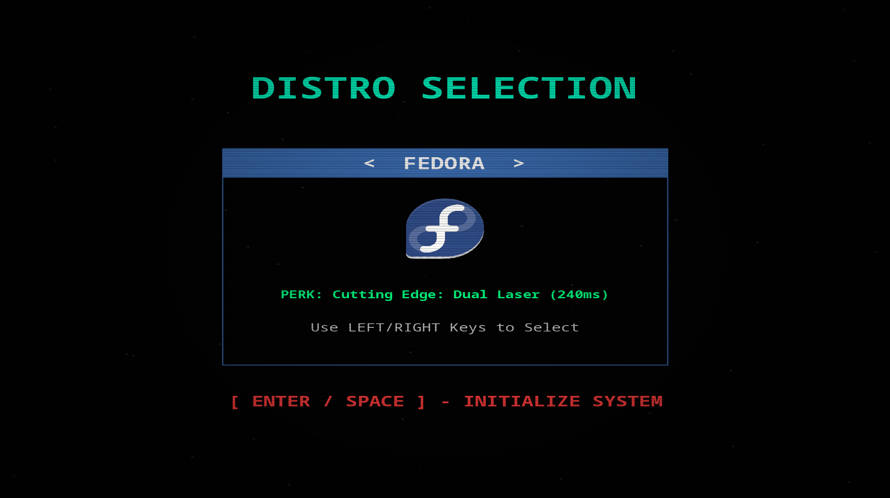
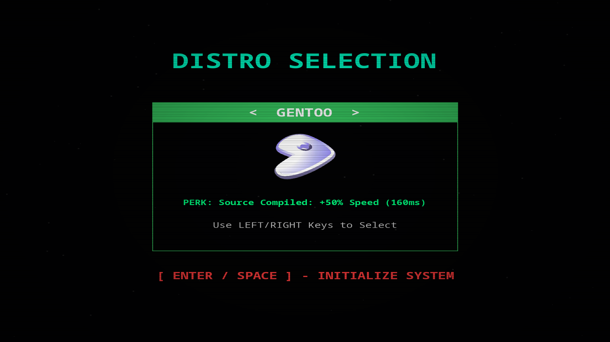

# Distro Invaders

A retro-terminal themed 2D arcade shooter built with Java. Defend your Arch Linux system from incoming OS distributions before they crash your kernel!

[Download](#download--run) • [Features](#features) • [Controls](#controls) • [Build](#build-from-source)

## Screenshots

### Main Menu


### Man Page (Controls)


### Gameplay


## About The Game

Distro Invaders is a lightweight, dependency-free Java Swing game. You play as the Arch Linux logo at the bottom of the screen. Your objective is to shoot down incoming waves of Ubuntu, Fedora, Debian, Manjaro, and Windows logos using your terminal laser.

If a distro slips past or hits your system directly, it triggers a **KERNEL PANIC** (Game Over).

## Features

* **Retro CRT Rendering:** Custom scanlines and vignette overlay for that classic terminal monitor feel.
* **Bilingual UI:** Press `[L]` on the main menu to toggle between English and Turkish.
* **Dynamic Difficulty:** Enemy speed and spawn rates increase the longer your system "Uptime" lasts.
* **BGM Support:** Retro background audio loop (`bgm.wav`).
* **Zero External Dependencies:** Written entirely in pure Java (`javax.swing` and `java.awt`).
* **AppImage Release:** Play instantly on Linux without dealing with Java paths or installations.

## Controls

| **Key** | **Action** | 
| :--- | :--- | 
| **Left / Right Arrows** | Move your system (Arch) | 
| **Spacebar** | Fire terminal command (Laser) | 
| **L** | Toggle language (EN/TR) on the main menu | 
| **Enter / Space** | Select menu option | 
| **R** | Hard Reboot (Restart after Kernel Panic) | 
| **ESC** | Go back / Exit system | 

## Download & Run

### Using the AppImage (Linux)

The easiest way to play on Linux is using the pre-compiled AppImage.

1. Go to the [Releases](../../releases) page and download `Distro_Invaders-x86_64.AppImage`.
2. Make it executable:
   ```bash
   chmod +x Distro_Invaders-x86_64.AppImage
   ```
3. Run it:
   ```bash
   ./Distro_Invaders-x86_64.AppImage
   ```
*(Requires Java JRE 8+ installed on your system)*

## Build from Source

If you want to compile the game yourself:

```bash
# 1. Clone the repository
git clone https://github.com/SirAtilotty/DistroInvaders.git
cd DistroInvaders

# 2. Compile the Java file
javac DistroInvaders.java

# 3. Run the game
java DistroInvaders
```

### Packaging a runnable JAR:

```bash
jar cfe DistroInvaders.jar DistroInvaders *.class
java -jar DistroInvaders.jar
```

## Credits

* **Developer & Architect:** [SirAtilotty](https://github.com/SirAtilotty)

  ## 🚀 What's New in v1.1.0

The highly anticipated **v1.1.0** update transforms the game from a single-ship shooter into a multi-distro tactical defense system! 

### 🌟 New Features

* **Distro Selection Screen:** You are no longer limited to just Arch Linux. You can now choose your fighter (distro) before initializing the system, each with unique passive perks:
  * **Arch Linux:** *Rolling Strafe* - Shoot while moving
  * **Debian:** *Rock Solid* - Starts with 2 HP, but has a slower fire rate (280ms).
  * **Fedora:** *Cutting Edge* - Fires a Dual Laser (240ms)
  * **Gentoo:** *Source Compiled* - Grants +50% movement speed (160ms)
* **High Score Tracking:** The main menu now saves and displays your highest Purge count (High Score) locally. Compete against your own uptime records!

### 📸 v1.1.0 Screenshots

**Main Menu (High Score Display)**


**Distro Selection: Arch Linux**


**Distro Selection: Debian**


**Distro Selection: Fedora**


**Distro Selection: Gentoo**

